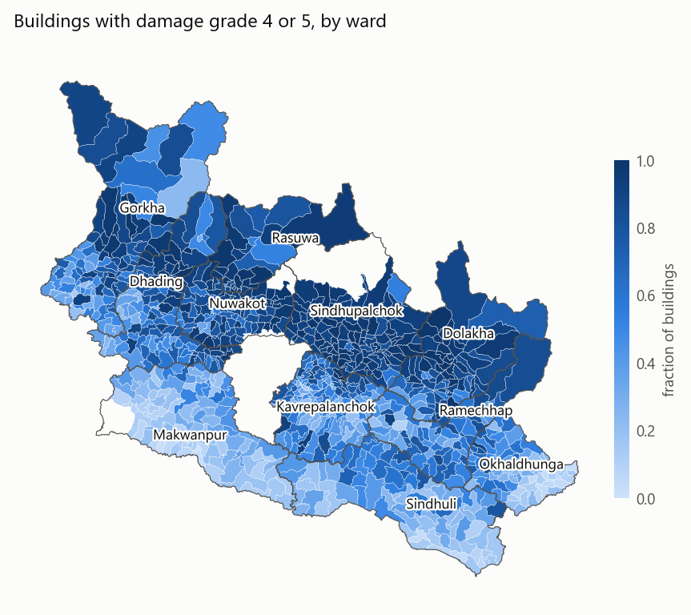
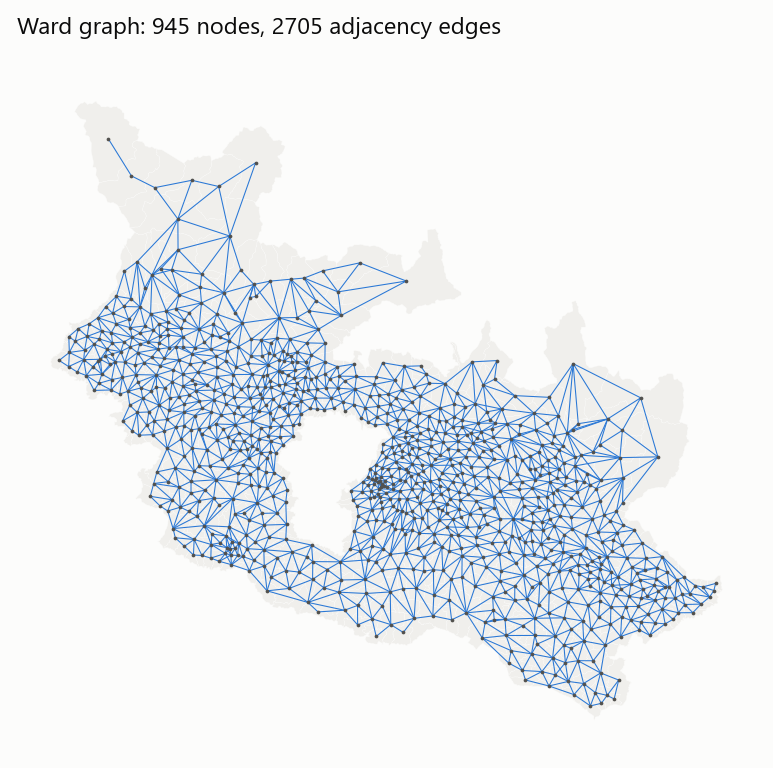
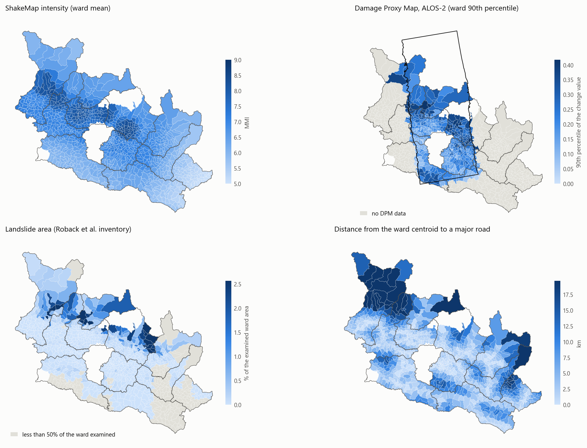
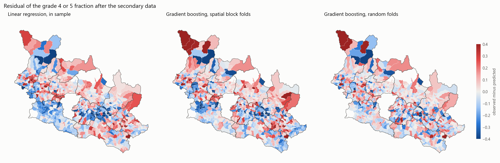

# Gate report: ward-level data for the Gorkha damage project

Date: 2026-10-06. The script `scripts/08_gate_report.py` writes this file from the files in `data/`.

## 1. Result

| Gate | Criterion | Value | Result |
|---|---|---|---|
| 1 | At least approximately 90% of the surveyed buildings match a ward polygon | 100.00% (762,094 of 762,094) | Pass |
| 2 | The residual Moran's I is positive and the permutation p-value is less than 0.05 | I = 0.356 and 0.308, p = 0.001 and 0.001 | Pass |

The graph has 945 wards (nodes) and 2705 adjacency edges.

## 2. Survey

- Buildings: 762,106. Buildings without a damage grade: 12.
- Wards in the name table: 949. Wards with buildings: 945.
- The survey uses the municipalities and wards of the federal structure of 2017.
- Buildings with grade 4 or 5: 60.3%.

Share of buildings for each damage grade:

| grade | share |
|---|---|
| 1 | 0.103 |
| 2 | 0.114 |
| 3 | 0.179 |
| 4 | 0.241 |
| 5 | 0.362 |

Proposed technical solution for each damage grade (row shares):

| grade | Major repair | Minor repair | No need | Reconstruction |
|---|---|---|---|---|
| 1 | 0.005 | 0.342 | 0.651 | 0.003 |
| 2 | 0.119 | 0.848 | 0.006 | 0.027 |
| 3 | 0.743 | 0.069 | 0.000 | 0.188 |
| 4 | 0.094 | 0.001 | 0.000 | 0.905 |
| 5 | 0.001 | 0.000 | 0.000 | 0.999 |

The survey proposes reconstruction for 90.5% of the grade 4 buildings and 99.9% of the grade 5 buildings.
Thus the label "grade 4 or 5" agrees with "reconstruction is necessary" in this data.
The grant eligibility rule in the government policy is not verified here.

## 3. Join of the survey wards to the OSM polygons (gate 1)

Key: district name, municipality name, ward number.

| district_name | wards_with_buildings | matched_wards | buildings | matched_buildings | building_match_rate |
|---|---|---|---|---|---|
| Dhading | 104 | 104 | 89122 | 89122 | 1.0000 |
| Dolakha | 74 | 74 | 60639 | 60639 | 1.0000 |
| Gorkha | 94 | 94 | 78074 | 78074 | 1.0000 |
| Kavrepalanchok | 135 | 135 | 98019 | 98019 | 1.0000 |
| Makwanpur | 102 | 102 | 90994 | 90994 | 1.0000 |
| Nuwakot | 88 | 88 | 77148 | 77148 | 1.0000 |
| Okhaldhunga | 75 | 75 | 39352 | 39352 | 1.0000 |
| Ramechhap | 64 | 64 | 58612 | 58612 | 1.0000 |
| Rasuwa | 27 | 27 | 12644 | 12644 | 1.0000 |
| Sindhuli | 79 | 79 | 68749 | 68749 | 1.0000 |
| Sindhupalchok | 103 | 103 | 88741 | 88741 | 1.0000 |

Decisions in the join:

- The OSM polygons give 945 wards in 110 municipalities for the 11 districts.
- The name score accepts 107 municipality pairs automatically. 16 of them have a score below 100 (spelling variants). The file `reports/join_municipalities.csv` lists all pairs.
- Manual decision for 3 municipality pairs with a score below 80. The pairs are: Baitedhar = Baiteshwor, Barpak Sulikot = Sulikot, Bhimsen Thapa = Bhimsen. In each case, the pair is the only unpaired unit on each side in its district, and the ward counts are equal.
- Manual decision for one ward number: survey ward 200608 (Marin, ward 8) = OSM "Marin-07". Marin has 7 wards on each side. The survey numbers are 1 to 6 and 8.
- Manual decision for one ward with a wrong municipality in the survey: survey ward 230209 ("Balephi ward 9") = OSM "Barhabise-09". The survey has 9 wards for Balephi and 8 wards for Bahrabise. The official numbers are 8 and 9. The user checked the official ward map of Balephi (LLRC, 2016) on 2026-10-06: the area of this polygon is part of Barhabise. The polygon is adjacent to Balephi wards 3, 7, and 8, and the ward number 9 is the same on the two sides. See `figures/balephi_barhabise_wards.png`.
- The ward number comes from the OSM name. The `ward` tag is the alternative. One relation ("Khijidemba-02") has `ward=1`.
- 4 survey rows have ward number 99 and 0 buildings (Langtang National Park, Parsa Wild Life Reserve, and one row of Panchpokhari Thangpal). They are not wards.

All survey wards with buildings have a polygon.

## 4. Graph

- Nodes: 945. Adjacency edges: 2705. Strict queen adjacency and adjacency with a 10 m tolerance give the same edges.
- Components: 1. Wards without a neighbor: 0. Added edges: 0.
- Degree: mean 5.72, minimum 1, maximum 12.
- Edge length (centroid distance): median 4.4 km, maximum 25.8 km.
- Nearest neighbor edges (k = 8): 4398, for the later ablation.
- Files: `data/processed/wards.gpkg`, `data/processed/wards.parquet`, `data/processed/graph.npz`. The plan named `graph.pt`. PyTorch is not installed until the GNN phase.

## 5. Features

All features come from data that do not use the survey building attributes.

| feature | mean | std | min | median | max |
|---|---|---|---|---|---|
| mmi | 6.832 | 0.797 | 5.029 | 6.902 | 8.468 |
| pga | 31.944 | 16.226 | 7.738 | 30.423 | 75.340 |
| pgv | 27.748 | 13.526 | 6.921 | 27.049 | 64.574 |
| vs30 | 789.270 | 83.911 | 443.091 | 818.993 | 900.000 |
| mmi_after | 5.383 | 0.971 | 3.941 | 5.163 | 7.650 |
| pga_after | 15.573 | 16.721 | 2.209 | 9.171 | 81.230 |
| pgv_after | 11.423 | 9.488 | 2.666 | 7.405 | 45.777 |
| mmi_max | 6.906 | 0.790 | 5.029 | 7.016 | 8.468 |
| elev_mean | 1346.101 | 695.029 | 187.546 | 1210.696 | 5043.081 |
| slope_mean | 22.556 | 6.300 | 1.656 | 23.661 | 41.033 |
| dpm_cover | 0.408 | 0.480 | 0.000 | 0.000 | 1.000 |
| dpm_valid_frac | 0.335 | 0.404 | 0.000 | 0.000 | 0.989 |
| dpm_mean | 0.002 | 0.054 | -0.214 | 0.000 | 0.240 |
| dpm_p90 | 0.101 | 0.127 | -0.016 | 0.000 | 0.512 |
| ls_mapped | 0.777 | 0.378 | 0.000 | 1.000 | 1.000 |
| ls_frac | 0.002 | 0.006 | 0.000 | 0.000 | 0.071 |
| dist_epi_km | 104.980 | 52.972 | 2.388 | 105.454 | 215.582 |
| dist_road_km | 4.656 | 4.890 | 0.013 | 2.852 | 33.496 |
| dist_hq_km | 16.760 | 10.421 | 0.129 | 14.776 | 79.205 |
| area_km2 | 22.084 | 36.807 | 0.441 | 14.349 | 498.168 |

Units: `pga` in %g, `pgv` in cm/s, `vs30` in m/s, `elev_mean` in m, `slope_mean` in degrees. `dpm_mean` and `dpm_p90` use (pixel value - 128) / 127, thus 0 is "no change".

Coverage by district:

| district_name | wards | wards_with_dpm | dpm_footprint_share | landslide_examined_share | wards_with_landslide |
|---|---|---|---|---|---|
| Dhading | 104 | 38 | 0.278 | 0.974 | 51 |
| Dolakha | 74 | 0 | 0.000 | 0.628 | 44 |
| Gorkha | 94 | 5 | 0.028 | 0.963 | 55 |
| Kavrepalanchok | 135 | 134 | 0.981 | 0.973 | 46 |
| Makwanpur | 102 | 47 | 0.379 | 0.584 | 21 |
| Nuwakot | 88 | 87 | 0.967 | 0.971 | 40 |
| Okhaldhunga | 75 | 0 | 0.000 | 0.325 | 3 |
| Ramechhap | 64 | 4 | 0.025 | 0.492 | 19 |
| Rasuwa | 27 | 27 | 0.998 | 0.942 | 24 |
| Sindhuli | 79 | 15 | 0.117 | 0.454 | 6 |
| Sindhupalchok | 103 | 66 | 0.584 | 0.990 | 95 |

- **Damage Proxy Map:** 423 of 945 wards have a DPM statistic (42.8% of the buildings). The ALOS-2 product covers a strip of approximately 70 by 180 km. Dolakha and Okhaldhunga have no DPM data. In the wards with DPM data, the correlation with the target is 0.33 for `dpm_mean` and 0.37 for `dpm_p90`.
- **Landslides:** 752 of 945 wards have more than 50% of the area in the examined extent (mapping extent minus obscured areas). `ls_mapped` gives this share for each ward.
- **ShakeMap:** the grid includes Vs30 (`SVEL`), thus the global Vs30 raster is not necessary.

Correlation of each transformed feature with the target:

| feature | pearson | spearman |
|---|---|---|
| mmi | 0.582 | 0.548 |
| pga | 0.612 | 0.562 |
| pgv | 0.583 | 0.551 |
| vs30 | 0.386 | 0.356 |
| mmi_after | 0.270 | 0.217 |
| pga_after | 0.281 | 0.242 |
| pgv_after | 0.271 | 0.220 |
| mmi_max | 0.655 | 0.655 |
| elev_mean | 0.352 | 0.389 |
| slope_mean | 0.363 | 0.280 |
| dpm_cover | 0.226 | 0.224 |
| dpm_valid_frac | 0.224 | 0.228 |
| dpm_mean | 0.212 | 0.179 |
| dpm_p90 | 0.298 | 0.290 |
| ls_mapped | 0.358 | 0.224 |
| ls_frac | 0.406 | 0.535 |
| dist_epi_km | -0.289 | -0.256 |
| dist_road_km | 0.080 | 0.079 |
| dist_hq_km | 0.044 | -0.007 |
| area_km2 | -0.004 | -0.098 |

## 6. Spatial autocorrelation (gate 2)

Weights: row-standardized adjacency. 999 permutations. Target: `frac_g45`.

| quantity | R2 | I | z | p |
|---|---|---|---|---|
| frac_g45 |  | 0.7581 | 39.0889 | 0.0010 |
| residual: linear regression, in sample | 0.6291 | 0.3563 | 18.1650 | 0.0010 |
| residual: gradient boosting, spatial block folds | 0.5822 | 0.3084 | 16.1370 | 0.0010 |
| residual: gradient boosting, random folds | 0.7063 | 0.0306 | 1.5741 | 0.0680 |

The same check for the mean damage grade:

| quantity | R2 | I | z | p |
|---|---|---|---|---|
| mean_grade |  | 0.8160 | 42.0849 | 0.0010 |
| residual: linear regression, in sample | 0.7041 | 0.4164 | 21.3215 | 0.0010 |
| residual: gradient boosting, spatial block folds | 0.6349 | 0.3783 | 19.9383 | 0.0010 |
| residual: gradient boosting, random folds | 0.7805 | 0.0624 | 3.2802 | 0.0020 |

- The gate uses the first two residual sets, as the plan specifies. The two sets pass.
- The third residual set is for information. With random folds, gradient boosting trains on 80% of the wards, and these wards are between the test wards. The residual Moran's I decreases to 0.031 (p = 0.068).
- Interpretation (not a measured result): with many labels, a flexible model can use the smooth features as a location signal. Thus the graph can add the most at low survey budgets. The baselines must include a flexible model without a graph.

Semivariance by distance between ward centroids (variance of `frac_g45`: 0.0841):

| distance | ward pairs | frac_g45 | residual of the linear regression |
|---|---|---|---|
| 0 to 5 km | 2211 | 0.0212 | 0.0190 |
| 5 to 10 km | 7071 | 0.0269 | 0.0245 |
| 10 to 15 km | 10387 | 0.0334 | 0.0288 |
| 15 to 20 km | 13110 | 0.0414 | 0.0310 |
| 20 to 30 km | 32387 | 0.0517 | 0.0324 |
| 30 to 40 km | 38306 | 0.0638 | 0.0332 |
| 40 to 60 km | 84426 | 0.0795 | 0.0321 |
| 60 to 80 km | 76704 | 0.1033 | 0.0301 |
| 80 to 120 km | 104328 | 0.0994 | 0.0303 |

- For ward pairs at 0 to 5 km, the semivariance of the residual (0.0190) is not smaller than the semivariance of the target (0.0212). Thus the linear regression on the features does not explain the differences between adjacent wards.
- The features explain the differences at long distances: at 80 to 120 km, the semivariance decreases from 0.0994 to 0.0303.

## 7. Limits of the data

1. **ShakeMap version.** The file is the USGS "atlas" product, updated 2020-07-07. It is not the map of the first week. The USGS product list also has a version of 2015-07-02.
2. **Landslide inventory.** The inventory files have the date 2017-02-09. Thus the full inventory was not available in the first week. The README lists landslide density as a permitted feature.
3. **Roads.** The major roads are the OSM roads of 2026-10-06, not the roads of April 2015.
4. **Damage Proxy Map.** Coverage is partial (Section 5). The value 128 is the fill value outside the radar footprint and also the value of masked pixels in the footprint.
5. **Building counts.** The building count of each ward comes from the survey. The metrics use it as a weight. A real survey plan must use a census count.
6. **Join.** The join has 5 manual decisions (Section 3). An error in one of them puts a label on the wrong polygon.
7. **Aftershock.** The door-to-door survey came after the Mw 7.3 aftershock of 2015-05-12. The G-DIF paper (Loos et al., 2020) states that the survey was completed by July 2016. Thus the damage grades include the aftershock damage. The ShakeMap features describe the mainshock of 2015-04-25 only. The residuals do not isolate an aftershock effect. The mean linear regression residual is -0.02 in Dolakha, which is near the aftershock. It is +0.06 in Dhading, +0.03 in Nuwakot, and +0.06 in Sindhupalchok.
